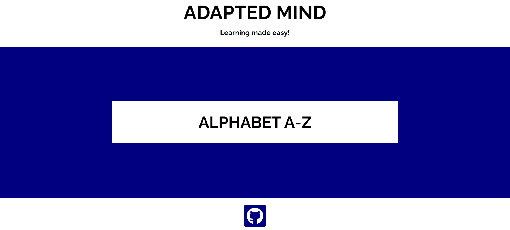

# *ADAPTED MIND*

Adapted Mind app was built for children to help simplify learning of alphabets. Alphabets are the basic foundation of every child learning. This app will help children learn alphabets and what they represent. The aim of Adapted Mind app is to enhance the learning abilities of children and build there basic foundation.

The site can be accessed by this [link](https://ovundiano.github.io/Adapted-Mind/)

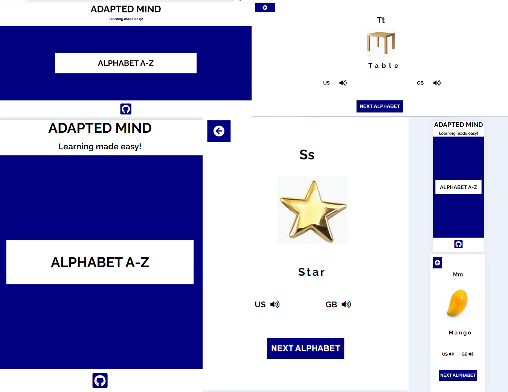

## User Stories

### First Time User Goals:

* As a First Time User, I want to be able to easily navigate through the app, so I can find the content.
* As a First Time User, I want to engage in learning to build my basic knowledge.

### Returning User Goals:

* As a Returning User, I want to see the various alphabets, so I can know my alphabets.
* As a Returning User, I want to be able to access information at a go and learn with ease.

### Regular User Goal:
* As a Regular User, I want to get constant access to learning materials, so I can continue learning.

## Features

+ ### Menu Page

    - Menu page has the header containing the Title of the app "ADAPTED MIND".

    - The header also contains a paragraph "Learning made easy!".

    - Menu page also contain a button:

        - Alphabet A-Z Button leads to the page where the user can learn and practice how to familiarise with alphabets and what it represent.
    
    - Menu page also contain the Footer Icon that has a live link to My GitHub page.

    

+ ### Alphabet A-Z Page

    - It has a button at the top left corner of the screen, which leads back to the menu page;

    - It has Card, which consist of an alphabet and what it represents;

    - Card has the key word and sound buttons, which allows the user to listen to the correct American and British pronunciation of the word;

    - It has a next alphabet button, which replaces the current alphabet and its representation with another alphabet and its representation. 

    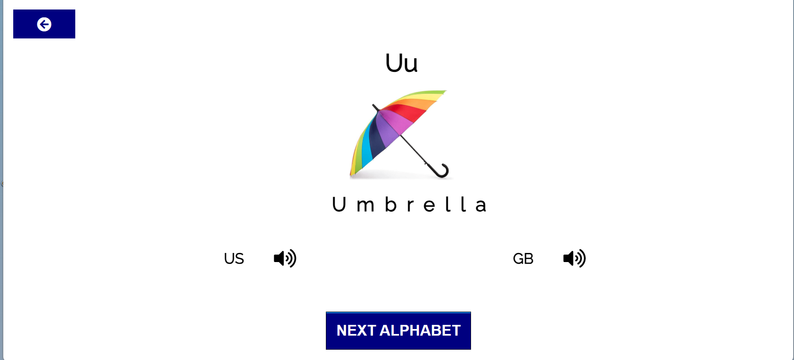

## Technologies Used

- [HTML](https://developer.chrome.org/en-US/docs/Web/HTML) was used as the foundation of the site.
- [CSS](https://developer.chrome.org/en-US/docs/Web/css) - was used to add the styles and layout of the site.
- [CSS Flexbox](https://developer.chrome.org/en-US/docs/Learn/CSS/CSS_layout/Flexbox) - was used to arrange items simmetrically on the pages.
- [JS](https://www.w3schools.com/js/) - was used to add interactivity to the site.
- [Gitpod](https://gitpod.io/workspaces/) was used as the main tool to write and edit code.
- [GitHub](https://github.com/) was used to host the code of the website.
- [TinyPNG](https://tinypng.com/) was used to resize images.
- [PineTools](https://pinetools.com/merge-images) was used to merge images.

## Design

### Color Scheme

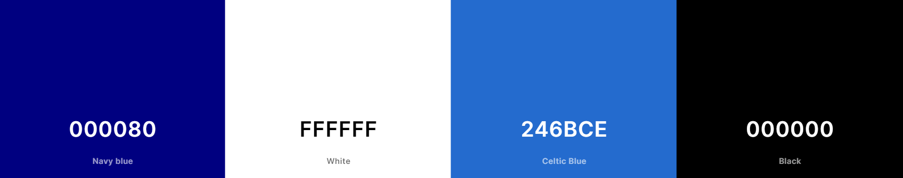

- Navy Color was used as the background color of the menu page, next alphabet button and back arrow button.

- White Color was used as the background color of the alphabet page and text color of the next alphabet button.

- Strong Blue color was used as the hover color of both pages.

- Black Color was used as text color of both pages.

### Typography

 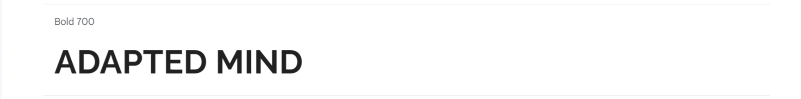

 - Raleway Google Font was used as the main font of the website in order to increase readability of the content on the pages.

## Bugs 

### Solved bugs
 -The Next Alphabet button wasn't generating the Next Random Alphabet when the Next Alphabet button was clicked on the preview window.

        ```js
        let randonAlphabets = Math.floor(Math.random() * alphabets.length);
        console.log(randomAlphabets);
        ```

 *Solution:* I made the  Random Alphabet a function() in the script.js and it started generating the next random alphabet.

        ```js
        let randomAlphabets = function () {
            return Math.floor(Math.random() * alphabets.length);
        };
        ```

 - The preview window wasn't generating Alphabet with it's corresponding Image and ImageSpellingWord when loaded.

        ```js
        async function fetchAlphabetsData() {
            let response = await fetch('assets/js/json/alphabets-data.json');
            alphabets = await response.json();
            console.log(alphabets);
        }
        ```

 *Solution:* I added generateAlphabet() function instead of console.log() function to the fetchAlphabetsData() of the JSON file.

        ```js
        async function fetchAlphabetsData() {
            let response = await fetch('assets/js/json/alphabets-data.json');
            alphabets = await response.json();
            generateAlphabet();
        }
        ```

 - The index.html file had bugs of undefined variables that doesn't exist in the index.html page in the devtool console.

  *Solution:* I removed the script file link added initially to the index.html page.
        ```<script src="assets/js/script.js"></script>```

 ### Unfixed Bugs

  - None.

## Testing 

 ### COMPATIBILITY:

  - The app was tested on the following browsers: Chrome, Firefox and Edge:

    - Chrome:

  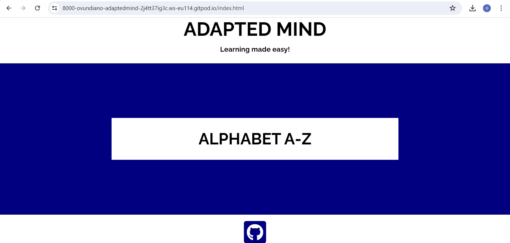
  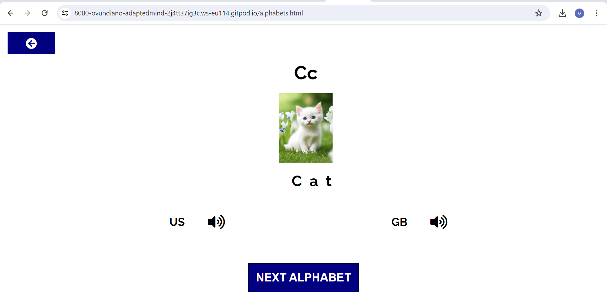

    - Firefox:

  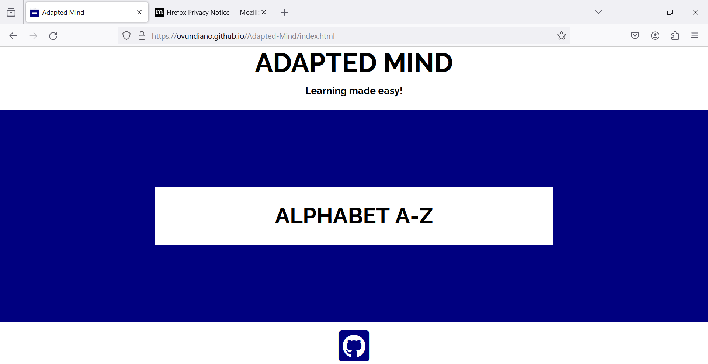
  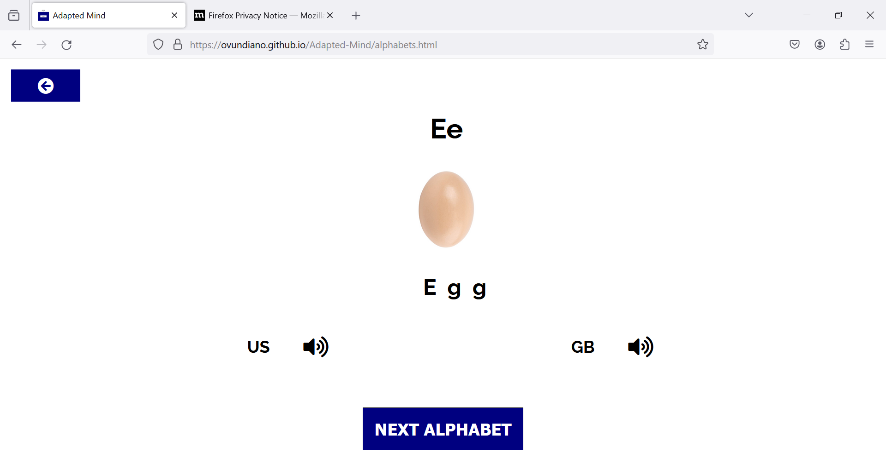

    - Edge:

  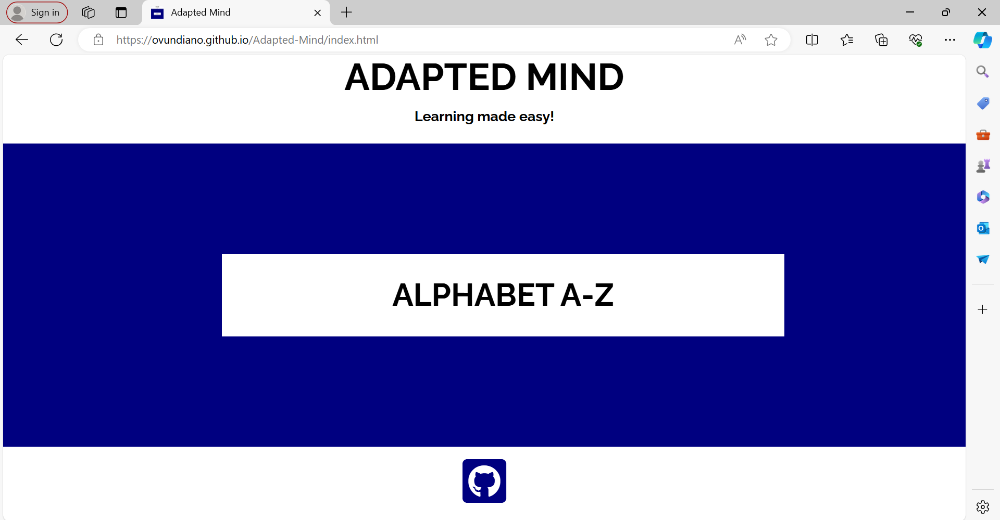
  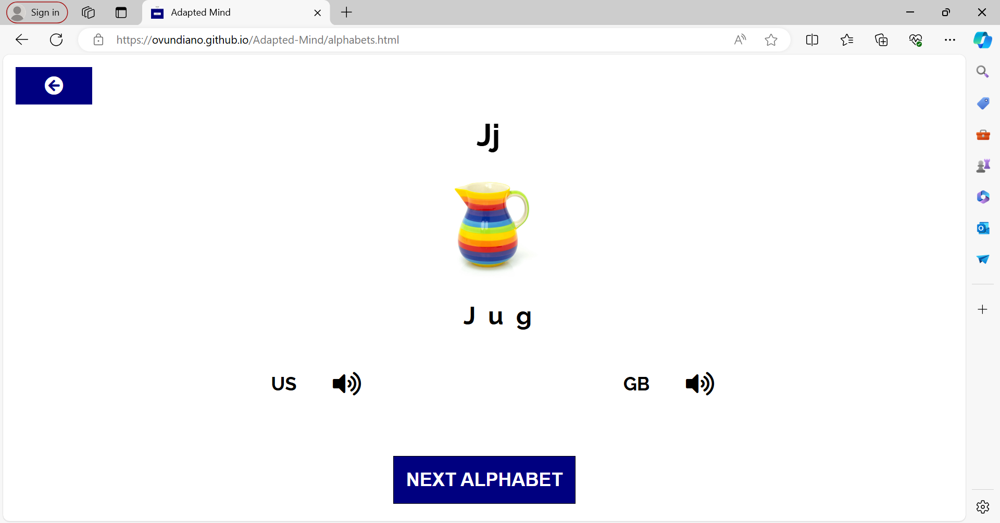 

 ### Devtool Responsive Testing

 - In order to confirm the responsivenes of the website across devices, the website was checked with devtools implemented in Chrome, Microsoft Edge and Firefox browsers.

 ### Validator testing

  #### HTML
    - No errors or warnings were found when passing through the official [W3C](https://validator.w3.org/) validator.
      - Menu Page:
          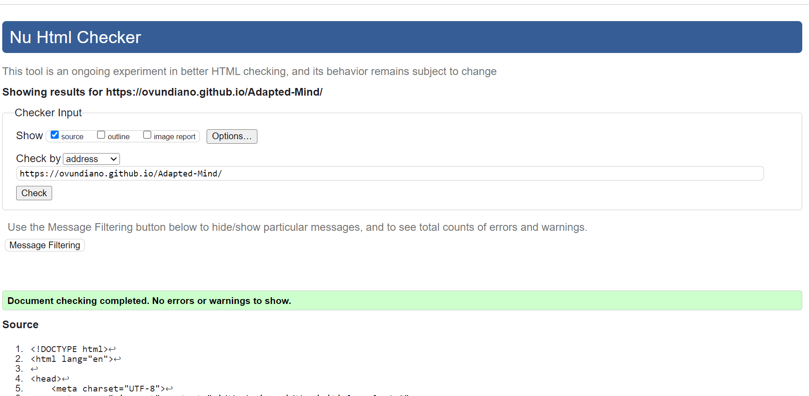
      - Card Page:
          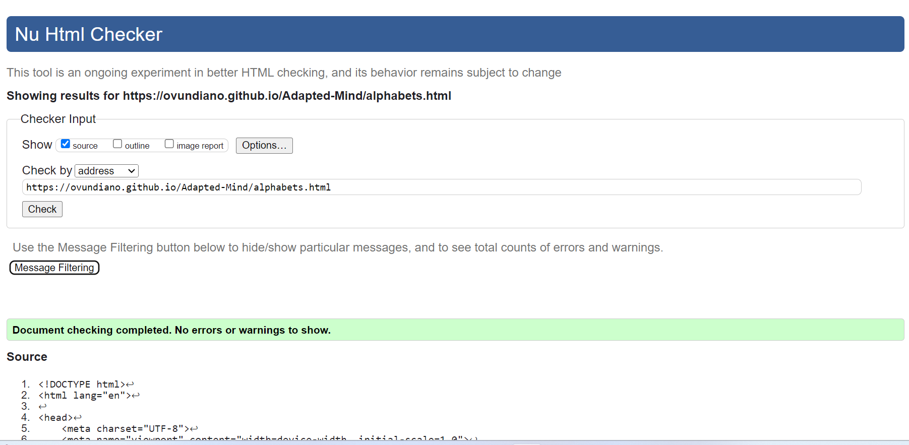

  ### CSS
    - No errors or warnings were found when passing through the official [W3C (Jigsaw)](https://jigsaw.w3.org/css-validator/#validate_by_uri) validator.
    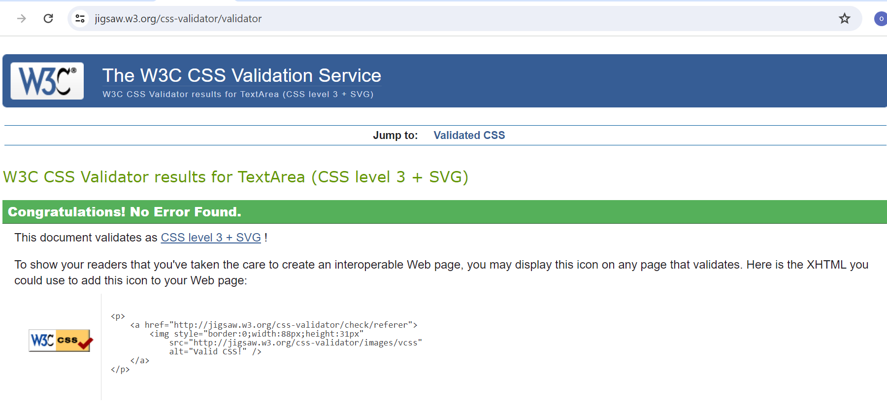

## Deployment

 ### Deployment to GitHub Pages

  - The site was deployed to GitHub pages. The steps to deploy are as follows: 
  - In the GitHub repository, navigate to the Settings tab.
  - From the general navigate to pages.
  - In the pages, from the source drop down menu, select the main branch, then click save.
  - Once saved, the link will be created to the website. 
    

  The live link can be found [here](https://ovundiano.github.io/Adapted-Mind/)

 ### Local Deployment

  - In order to make a local copy of this project, you can clone it.
  - In your IDE Terminal, type the following command to clone my repository:

   - `git clone https://github.com/Ovundiano/Adapted-Mind.git`

  - Alternatively, if you use Gitpod, you can [click here](https://gitpod.io/#https://https://github.com/ovundiano/adapted-mind.git), which will start the Gitpod workspace for you.

## Future improvements
 - Add custom 404 page;
 - Improve the quality of the commit messages (I am aware that some of them are not very clear and not meeting the standards and will improve them in the future);

## Credits  

 ### Content 

 - The inspiration was gotten from my daugter, to make learning of alphabets easy for her.
 - The name of the game "Adapted Mind" was gotten from [Adapted Mind](https://www.adaptedmind.com/).
 - GitHub icon in the footer was taken from [Font Awesome](https://fontawesome.com/)
 - The Raleway font was gotten from [Google Font](https://fonts.google.com/) 

 ### Media

 - The Apple image was gotten from [artplants.eu](https://www.artplants.eu/artificial-apple-adalbero-green-3-1-8cm-o3-1-8cm.html)

 - The banana image was gotten from [amazon.com](https://www.amazon.co.uk/Best-Artificial-Fruit-Veg-Bananas/dp/B00I5L4PU2/ref=asc_df_B00I5L4PU2/?tag=googshopuk-21&linkCode=df0&hvadid=345485807433&hvpos=&hvnetw=g&hvrand=5658211242454132803&hvpone=&hvptwo=&hvqmt=&hvdev=c&hvdvcmdl=&hvlocint=&hvlocphy=20479&hvtargid=pla-788077859243&mcid=9a4b198a44553ecbbac14b01f5eb3ca2&th=1)

 - The cat image was gotten from [etsy.com](https://www.etsy.com/ie/listing/1525988050/4-lovely-photos-of-kittens-to-melt-your?gpla=1&gao=1&&utm_source=google&utm_medium=cpc&utm_campaign=shopping_ie_en_ie_-home_and_living-home_decor&utm_custom1=_k_CjwKCAjwgpCzBhBhEiwAOSQWQceuNyIy2QdSZFcaRKOeCf_e6v_m1GyYT0Fe0MvFV1JvJ8nMDB1D0BoCyJ8QAvD_BwE_k_&utm_content=go_13703308034_123455838199_530490401497_aud-2079782229334:pla-303663659969_c__1525988050enie_432418375&utm_custom2=13703308034&gad_source=1&gclid=CjwKCAjwgpCzBhBhEiwAOSQWQceuNyIy2QdSZFcaRKOeCf_e6v_m1GyYT0Fe0MvFV1JvJ8nMDB1D0BoCyJ8QAvD_BwE)
 
 - The Dog image was gotten from [amazon.com](https://www.amazon.co.uk/Reofrey-Diamond-Painting-Accessories-Embroidery/dp/B0C14BHF4H/ref=asc_df_B0C14BHF4H/?tag=googshopuk-21&linkCode=df0&hvadid=678566321209&hvpos=&hvnetw=g&hvrand=4744681330621965420&hvpone=&hvptwo=&hvqmt=&hvdev=c&hvdvcmdl=&hvlocint=&hvlocphy=20479&hvtargid=pla-2244622616307&psc=1&mcid=a565e1a6e5893df5abe2c8f78c8dee64&gad_source=1)
  
 - The Egg image was gotten from [fruugo.ie](https://www.fruugo.ie/1-simulation-easter-eggs-wooden-fake-eggs-23-inch-solid-eggs-fan0305/p-273442201-606507480?language=en&ac=croud&asc=pmax&gad_source=1&gclid=CjwKCAjwgpCzBhBhEiwAOSQWQZx_keUq4ms2QUPOmKY08Huj4q06YSVxGN7DFkILCM1nHdQo2pkFIxoCCz4QAvD_BwE)

 - The Fish image was gotten from [amazon.com](https://www.amazon.co.uk/Simulation-Pillow%EF%BC%8CDecorate-Decorate-Oversized-Creative/dp/B0BLRYFD6H/ref=asc_df_B0BLRYFD6H/?tag=googshopuk-21&linkCode=df0&hvadid=649314500303&hvpos=&hvnetw=g&hvrand=2377051287241288729&hvpone=&hvptwo=&hvqmt=&hvdev=c&hvdvcmdl=&hvlocint=&hvlocphy=20479&hvtargid=pla-1989738914794&psc=1&mcid=39b8da9ce99a3d6ba00a39489b8b6ca8)

 - The Guava image was gotten from [ebay.co.uk](https://www.ebay.co.uk/itm/233736990549)

 - The House image was gotten from [ebay.co.uk](https://www.ebay.co.uk/itm/325460475785?chn=ps&_ul=GB&norover=1&mkevt=1&mkrid=710-169260-534375-3&mkcid=2&keyword=&crlp=670833748941_&MT_ID=&geo_id=&rlsatarget=pla-293946777986&adpos=&device=c&mktype=pla&loc=20479&poi=&abcId=&cmpgn=20488672762&sitelnk=&adgroupid=155578564071&network=g&matchtype=&gad_source=1&gclid=CjwKCAjwgpCzBhBhEiwAOSQWQQBwqB4UHSDeMq22r4RrWKNfVU5ZxUWOZ7ElhrVP8Kf1n-8L3kmh0RoCGYgQAvD_BwE)

 - The Ice-cream image was gotten from [etsy.com](https://www.etsy.com/ie/listing/1511998203/ice-cream-clipart-set-of-10-digital?gpla=1&gao=1&&utm_source=google&utm_medium=cpc&utm_campaign=shopping_ie_en_ie_-craft_supplies_and_tools-canvas_and_surfaces&utm_custom1=_k_CjwKCAjwgpCzBhBhEiwAOSQWQTpgNSOJE7BouwwPMKxgwY9QWUrRy7p9c3ZV9Cqv-M41jcOCeDgRyxoCCE8QAvD_BwE_k_&utm_content=go_13703308031_123455837279_530490401461_aud-2079782229334:pla-326655468364_c__1511998203enie_5302856390&utm_custom2=13703308031&gad_source=1&gclid=CjwKCAjwgpCzBhBhEiwAOSQWQTpgNSOJE7BouwwPMKxgwY9QWUrRy7p9c3ZV9Cqv-M41jcOCeDgRyxoCCE8QAvD_BwE)

 - The Jug image was gotten from [ebay.co.uk](https://www.ebay.ie/)

 - The Kettle image was gotten from [amazon.com](https://www.amazon.co.uk/SHANGZHER-Induction-Whistling-Kettle-Colour/dp/B09L52VDZ7/ref=asc_df_B09L52VDZ7/?tag=googshopuk-21&linkCode=df0&hvadid=570408700271&hvpos=&hvnetw=g&hvrand=7667676584192042450&hvpone=&hvptwo=&hvqmt=&hvdev=c&hvdvcmdl=&hvlocint=&hvlocphy=20479&hvtargid=pla-1597575755424&psc=1&mcid=8986d7cfcae8309d84f3f6000f817d2f)

 - The Lemon image was gotten from [amazon.com](https://www.amazon.co.uk/Gourmands-Lemon-Collection-Stories-Recipes/dp/3836585901/ref=asc_df_3836585901/?tag=googshopuk-21&linkCode=df0&hvadid=676236594673&hvpos=&hvnetw=g&hvrand=16447874111772097128&hvpone=&hvptwo=&hvqmt=&hvdev=c&hvdvcmdl=&hvlocint=&hvlocphy=20479&hvtargid=pla-2244205442620&psc=1&mcid=ea10f9eb4d443eca912e294c2beff493&th=1&psc=1&gad_source=1)

 - The Mango image was gotten from [artplants.eu](https://www.artplants.eu/plastic-mango-florisa-orange-yellow-5-13cm-o-3-1-8cm.html?pk_campaign=&pk_kwd=&pk_source=googleAds&pk_medium=&pk_content=&gad_source=1&gclid=CjwKCAjwgpCzBhBhEiwAOSQWQQ6vHXBBDLNMYuYHvoCnXoLXS-kw51hQUV7gdibrTj2LUVrQaFD2jBoCGQYQAvD_BwE)

 - The Nest image was gotten from [irl.grandado.com](https://irl.grandado.com/products/rattan-nesting-bird-nest-props-handicrafts-henhouse-home-decoration-decoration-natural-handmade-easter-birds-nest?variant=UHJvZHVjdFZhcmlhbnQ6NjA1NTU4Njg&gad_source=1&gclid=CjwKCAjwgpCzBhBhEiwAOSQWQZyshIRYQmdcyJ2-DGCG_pzAHQUDMGgtFbJYXwuQtKISZZjPMfvJ3xoCWigQAvD_BwE)

 - The Orange image was gotten from [fruugo.ie](https://www.fruugo.ie/fruit-photo-props-education-display-props-creative-gift-plastic-artificial-home-wedding-showcase-decorations-orange/p-212218310-452578709?language=en&ac=croud&asc=pmax&gad_source=1&gclid=CjwKCAjwgpCzBhBhEiwAOSQWQQxpBwzSintzVNJ0wUCxs3DMnzyI-V-6qDiSsQMSImS_xR8o5PyVhhoCSwIQAvD_BwE)

 - The Rat image was gotten from [ebay.co.uk](https://www.ebay.co.uk/itm/185872622895?chn=ps&_ul=GB&var=693841919283&_trkparms=ispr%3D1&amdata=enc%3A1POC407XFQy6tgsnsPG7fDA79&norover=1&mkevt=1&mkrid=710-169260-534375-3&mkcid=2&keyword=&crlp=670833748941_&MT_ID=&geo_id=&rlsatarget=pla-293946777986&adpos=&device=c&mktype=pla&loc=20479&poi=&abcId=&cmpgn=20488672762&sitelnk=&adgroupid=155578564071&network=g&matchtype=&gad_source=1&gclid=CjwKCAjwgpCzBhBhEiwAOSQWQclknbQ_N-UuC586d-We5i2IcOgiZ5b9ktQ5ttt7T6hytixf5eh-PhoCK-AQAvD_BwE)

 - The Star image was gotten from [amazon.com](https://www.amazon.co.uk/Gold-Star-Pin-badge-Pack/dp/B00O8PPU0S/ref=asc_df_B00O8PPU0S/?tag=googshopuk-21&linkCode=df0&hvadid=321467364611&hvpos=&hvnetw=g&hvrand=220813858926427110&hvpone=&hvptwo=&hvqmt=&hvdev=c&hvdvcmdl=&hvlocint=&hvlocphy=20479&hvtargid=pla-696911648107&psc=1&mcid=228631126a8331d48cabc09fa8e2eaf3)

 - The Table image was gotten from [amazon.com](https://www.amazon.co.uk/Ikea-Lack-Small-Coffee-Table-55x45x55/dp/B00GMMDUIY/ref=asc_df_B00GMMDUIY/?tag=googshopuk-21&linkCode=df0&hvadid=226543000788&hvpos=&hvnetw=g&hvrand=13922216650052790471&hvpone=&hvptwo=&hvqmt=&hvdev=c&hvdvcmdl=&hvlocint=&hvlocphy=20479&hvtargid=pla-420899094179&psc=1&mcid=e10323b167803d02962d2c0e27690973)

 - The Umbrella image was gotten from [ebay.co.uk](https://www.ebay.co.uk/sch/i.html?_from=R40&_nkw=rainbow+umbrella&_sacat=0&_pgn=1)

 - The Van image was gotten from [ebay.co.uk](https://www.ebay.co.uk/itm/235521773263?chn=ps&_ul=GB&norover=1&mkevt=1&mkrid=710-169260-534375-3&mkcid=2&keyword=&crlp=670833748941_&MT_ID=&geo_id=&rlsatarget=pla-293946777986&adpos=&device=c&mktype=pla&loc=20479&poi=&abcId=&cmpgn=20488672762&sitelnk=&adgroupid=155578564071&network=g&matchtype=&gad_source=1&gclid=CjwKCAjwgpCzBhBhEiwAOSQWQef043Q0Pg0D6gvPEzb29EjigMD1D-Obs6XPXzoZfTRCbfzBTiRGmhoCzukQAvD_BwE)

 - The Watermelon image was gotten from [fruugo.ie](https://www.fruugo.ie/watermelon-high-strength-professional-flavouring/p-70108127-140722132?language=en&ac=croud&asc=pmax&gad_source=1&gclid=CjwKCAjwgpCzBhBhEiwAOSQWQUobNPhdPC1aHDtfhlWOxO09uDZRDO1MTBkZ8pMWWSvTUepZrmB4dxoCPCEQAvD_BwE)

 - The Xylophone image was gotten from [amazon.com](https://www.amazon.co.uk/Bigjigs-Toys-Wooden-Snazzy-Xylophone/dp/B005GTDCRS/ref=asc_df_B005GTDCRS/?tag=googshopuk-21&linkCode=df0&hvadid=310513207086&hvpos=&hvnetw=g&hvrand=788361244038325978&hvpone=&hvptwo=&hvqmt=&hvdev=c&hvdvcmdl=&hvlocint=&hvlocphy=20479&hvtargid=pla-565307527668&psc=1&mcid=b8ab622969de3c53893173c6bfe66bb1)

 - The Yatch image was gotten from [etsy.com](https://www.etsy.com/ie/listing/1526203801/luxury-yacht-watercolor-clipart-bundle?gpla=1&gao=1&&utm_source=google&utm_medium=cpc&utm_campaign=shopping_ie_en_ie_-craft_supplies_and_tools-canvas_and_surfaces&utm_custom1=_k_CjwKCAjwgpCzBhBhEiwAOSQWQT5P3Bo7Qiy7M9Sxz4gQzMci7f0KuIGTYYkNcsUPotkvIbJGV_CYtBoCyKgQAvD_BwE_k_&utm_content=go_13703308031_123455837279_530490401461_aud-2079782229494:pla-326655468364_c__1526203801enie_5316607821&utm_custom2=13703308031&gad_source=1&gclid=CjwKCAjwgpCzBhBhEiwAOSQWQT5P3Bo7Qiy7M9Sxz4gQzMci7f0KuIGTYYkNcsUPotkvIbJGV_CYtBoCyKgQAvD_BwE)

 - The Zebra image was gotten from [ebay.co.uk](https://www.ebay.co.uk/itm/186182795154?chn=ps&_ul=GB&var=694219319934&norover=1&mkevt=1&mkrid=710-169260-534375-3&mkcid=2&keyword=&crlp=670833748941_&MT_ID=&geo_id=&rlsatarget=pla-293946777986&adpos=&device=c&mktype=pla&loc=20479&poi=&abcId=&cmpgn=20488672762&sitelnk=&adgroupid=155578564071&network=g&matchtype=&gad_source=1&gclid=CjwKCAjwgpCzBhBhEiwAOSQWQQAAd4KOeyqBc9kHLt46G69_TNCfxBASnnOwkL7W8H9mrxzyioJB7RoCzZsQAvD_BwE)

## Acknowledgement 
  - Divine Mazi, My wife was a great support system towards Me actualizing this project.
  - [Iuliia Konovalova](https://github.com/IuliiaKonovalova) was a great mentor and thanks for pushing me out of my comfort zone.
  - [Code Institute Tutor Support](https://learn.codeinstitute.net/ci_support/diplomainfullstacksoftwarecommoncurriculum/tutor) tutors for their support and help.
  - [Quora](https://www.quora.com/What-is-the-best-way-to-generate-an-array-of-JSON-objects-dynamically-in-JavaScript#:~:text=There%20are%20several%20ways%20to,jsonArray.) for the Indepth Knowledge on how to write the code to generate array of JSON objects in JavaScript.
  - [geeksforgeeks](https://www.geeksforgeeks.org/how-to-use-the-javascript-fetch-api-to-get-data/?ref=ml_lbp) for the indepth knowledge of fetch() Function.
  - [mdnwebdocs](https://developer.mozilla.org/en-US/docs/Web/API/SpeechSynthesis/speak) for the indepth knowledge of speakFunction().
  - [w3schools](https://www.w3schools.com/js/js_json.asp) for the indepth knowledge of JSON data storage file.
  - [freeCodeCamp](https://www.freecodecamp.org/news/asynchronous-programming-in-javascript/#:~:text=In%20summary%2C%20asynchronous%20programming%20is,async%2Fawait%2C%20and%20promises.) for the indepth knowledge of Async() Function.
  - [webplatformcourse](https://webplatformcourse.com/bonus/speech-synthesis-api/#:~:text=The%20SpeechSynthesisUtterance%20object%20available%20on,the%20browser%20should%20read%20aloud.) for the indepth knowledge of SpeechSynthesisUtterance() Function.