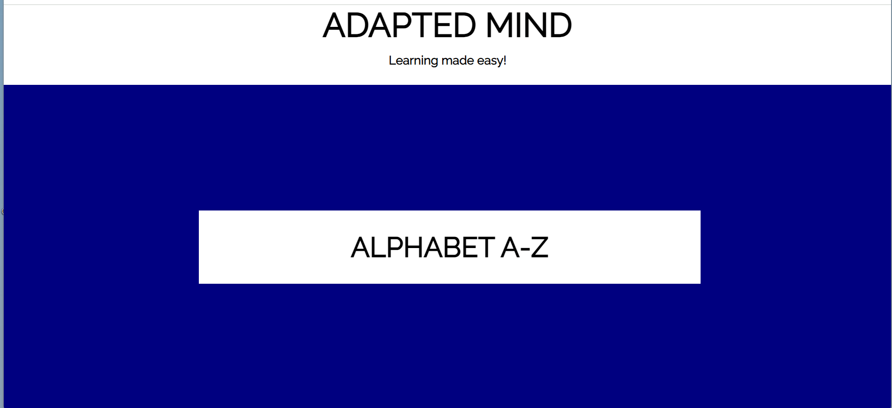
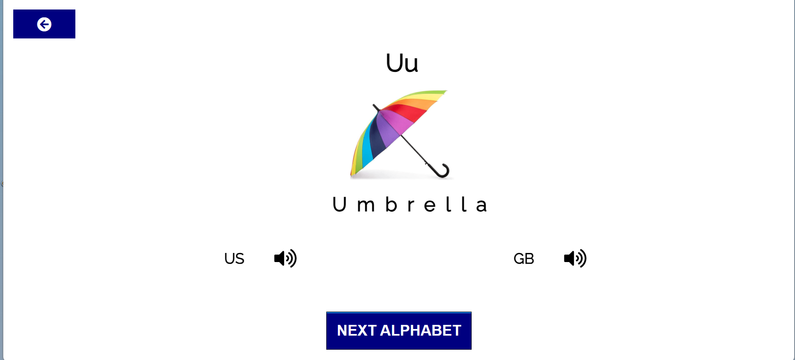

# *ADAPTED MIND*

Adapted Mind app was built for children to help simplify learning of alphabets. Alphabets are the basic foundation of every child learning. This app will help children learn alphabets and what they represent. The aim of Adapted Mind app is to enhance the learning abilities of children and build there basic foundation.

The site can be accessed by this [link](https://ovundiano.github.io/Adapted-Mind/)

## User Stories

### First Time User Goals:

* As a First Time User, I want to be able to easily navigate through the app, so I can find the content.
* As a First Time User, I want to engage in learning to build my basic knowledge.

### Returning User Goals:

* As a Returning User, I want to see the various alphabets, so I can know my alphabets.
* As a Returning User, I want to be able to access information at a go and learn with ease.

### Regular User Goal:
* As a Regular User, I want to get constant access to learning materials, so I can continue learning.

## Features

+ ### Menu Page

    - Menu page has the header containing the Title of the app "ADAPTED MIND".

    - The header also contains a paragraph "Learning made easy!".

    - Menu page also has 1 main button:

        - Alphabet A-Z Button leads to the page where the user can learn and practice how to familiarise with alphabets and what it represent.

    

+ ### Alphabet A-Z Page

    - It has a button at the top left corner of the screen, which leads back to the menu page;

    - It has Card, which consist of an alphabet and what it represents;

    - Card has the key word and sound buttons, which allows the user to listen to the correct American and British pronunciation of the word;

    - It has a next alphabet button, which replaces the current alphabet and its representation with another alphabet and its representation. 

    

## Technologies Used

- [HTML](https://developer.chrome.org/en-US/docs/Web/HTML) was used as the foundation of the site.
- [CSS](https://developer.chrome.org/en-US/docs/Web/css) - was used to add the styles and layout of the site.
- [CSS Flexbox](https://developer.chrome.org/en-US/docs/Learn/CSS/CSS_layout/Flexbox) - was used to arrange items simmetrically on the pages.
- [CSS Grid](https://developer.chrome.org/en-US/docs/Web/CSS/grid) - was used to make "gallery" and "contact" pages responsive.
- [JS](https://www.w3schools.com/js/) - was used to add interactivity to the site.
- [Gitpod](https://gitpod.io/workspaces/) was used as the main tool to write and edit code.
- [GitHub](https://github.com/) was used to host the code of the website.
- [TinyPNG](https://tinypng.com/) was used to resize images.

